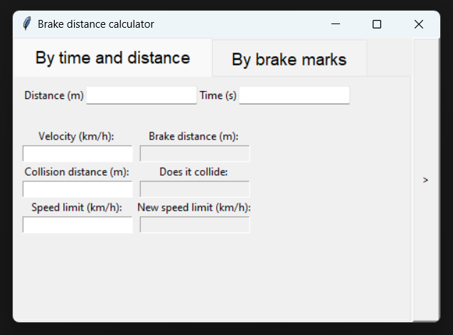
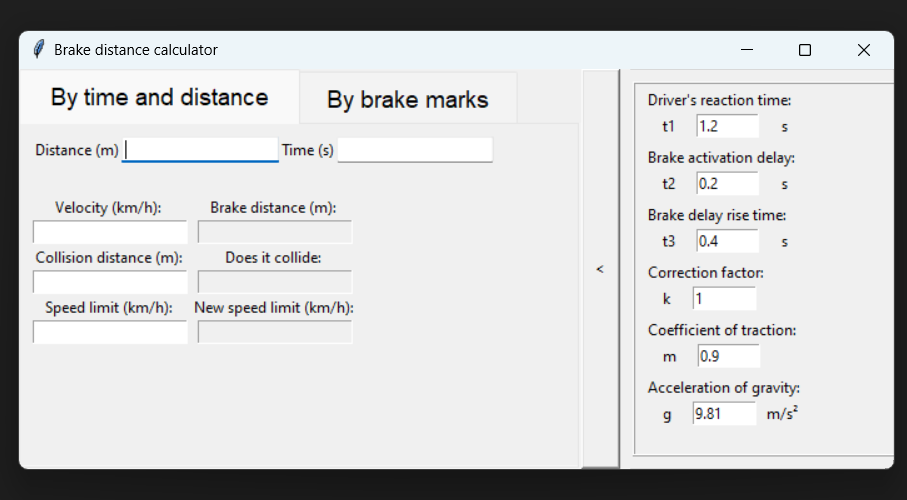

# Brake distance calculator

This is a simple calculator to calculate the braking distance of a moving vehicle. It accounts for the reaction time of the driver, the time it takes for the brakes to be applied the traction of the tires and the speed of the vehicle. It can also calculate the speed of the vehicle given the braking distance.



Velocity can be input 3 different ways:
1. As a single value
2. As time and distance traveled
3. As length of brake marks on the road

By pressing enter the app will calculate the braking distance and display it in the output field. Then the user can enter collision distance and and the app will output wether the vehicle will collide or not. If it collides you can enter the road speed limit and the app will output if obeying the speed limit would have prevented the collision. If not it will output a new speed limit that would have prevented the collision.

You can also edit other parameters by opening the advanced menu by clicking the button on the right.



The advanced menu allows you to change parameters like the reaction time of the driver or the friction coefficient.

The app is written in Python and uses the Tkinter library for the GUI.

## How to compile

To compile the app you need to have Python installed. You can download it from the official website [here](https://www.python.org/downloads/).

Compile using pyinstaller using:

```pyinstaller.exe main.py --onefile --noconsole```